# Cloud-Based Security Monitoring with Wazuh

In this project, I demonstrated proficiency in cybersecurity and cloud server management by deploying a comprehensive security monitoring solution using Wazuh on a Linode cloud server. Key aspects of this project include:

- **Cloud Server Setup:** Deployed and configured a Wazuh server on Linode, showcasing my ability to work with cloud infrastructure and manage server environments effectively.
- **Agent Integration:** Successfully integrated two agents from Kali Linux and Windows VirtualBox into the Wazuh server. This task involved ensuring seamless communication between the agents and the server, demonstrating my skills in network configuration and system integration.
- **File Integrity Monitoring (FIM):** Implemented FIM using Wazuh's whodata to monitor changes in the public directory. This involved configuring detailed monitoring rules to detect unauthorized or unexpected modifications, enhancing the system's security posture.
- **Active Response Configuration:** Developed and implemented a custom Python script for active response to automatically drop connections for SSH login attempts with incorrect usernames. This task highlighted my scripting skills and understanding of automated security responses.
- **Vulnerability Detection:** Enabled and configured the Wazuh vulnerability detector to identify and report potential vulnerabilities within the monitored systems, demonstrating my ability to enhance system security through proactive monitoring.
- **Slack Integration for Alerts:** Integrated Wazuh alerts with Slack to ensure real-time notifications of security events, illustrating my capability to implement effective communication channels for security monitoring.

**Skills Demonstrated:**

- Cloud Computing and Server Management
- Linux and Windows System Administration
- Network Configuration and Security
- Scripting and Automation with Python
- File Integrity Monitoring
- Vulnerability Assessment and Management
- Real-time Alerting and Integration

This project underscores my technical expertise and ability to deploy, configure, and manage security monitoring solutions in a cloud environment.

**Linode Setup**
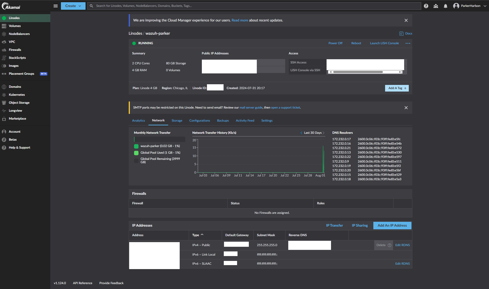
**Agent Integration**
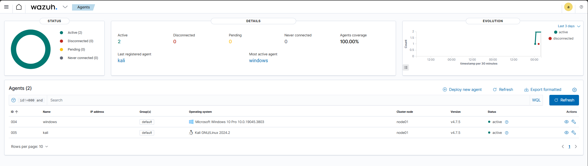
**File Integrity Monitoring (FIM)**
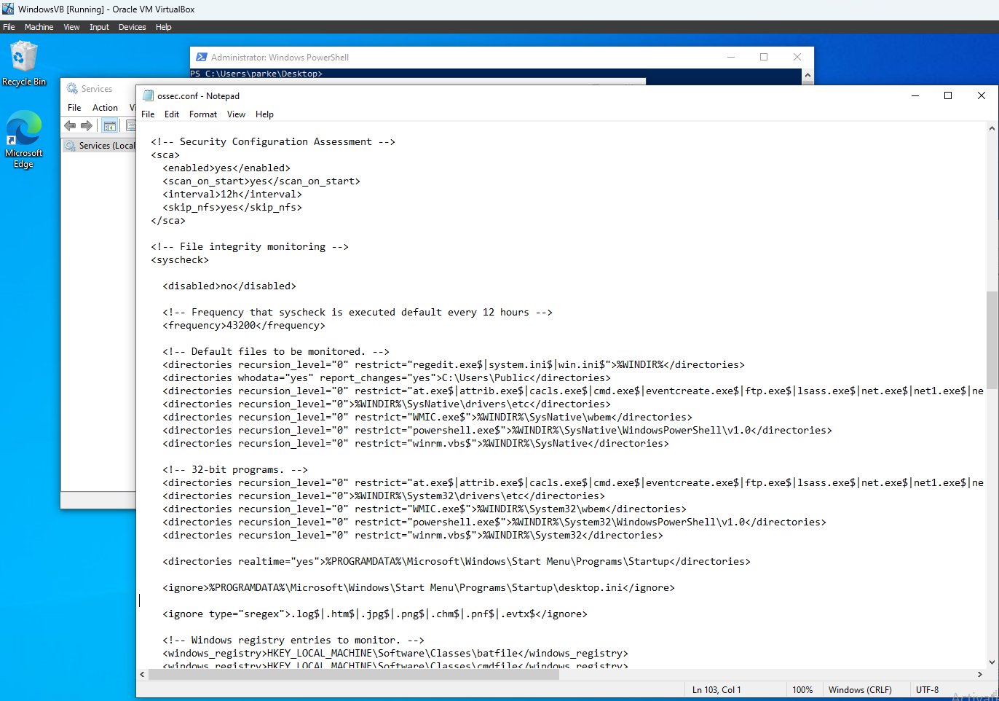 
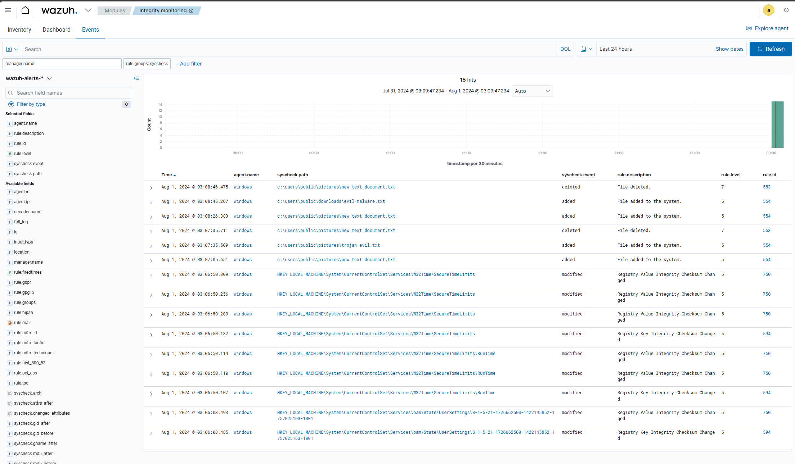 
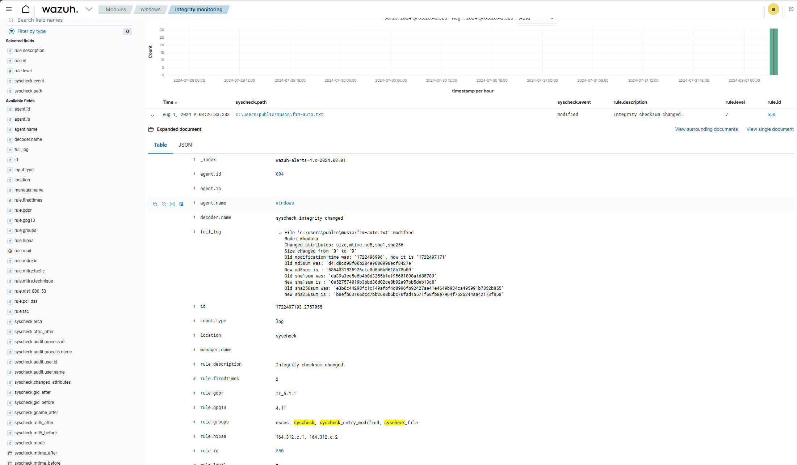
**Active Response Configuration** 
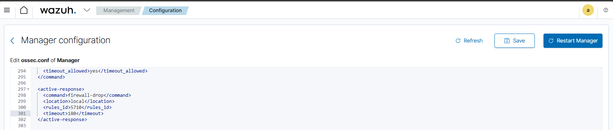 
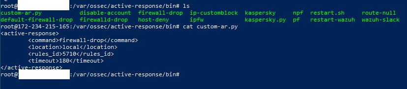 
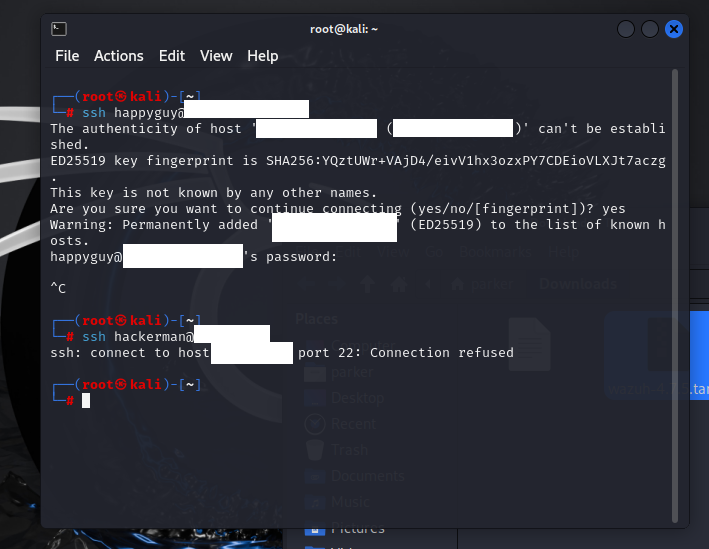
**Vulnerability Detection (enabled and configured)** 
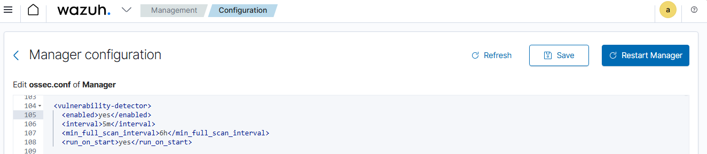
**Slack Integration for Alerts**
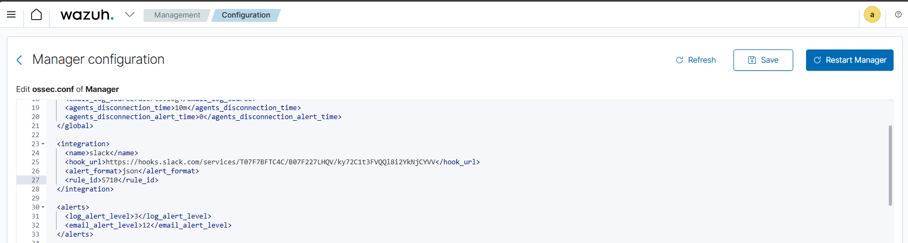 
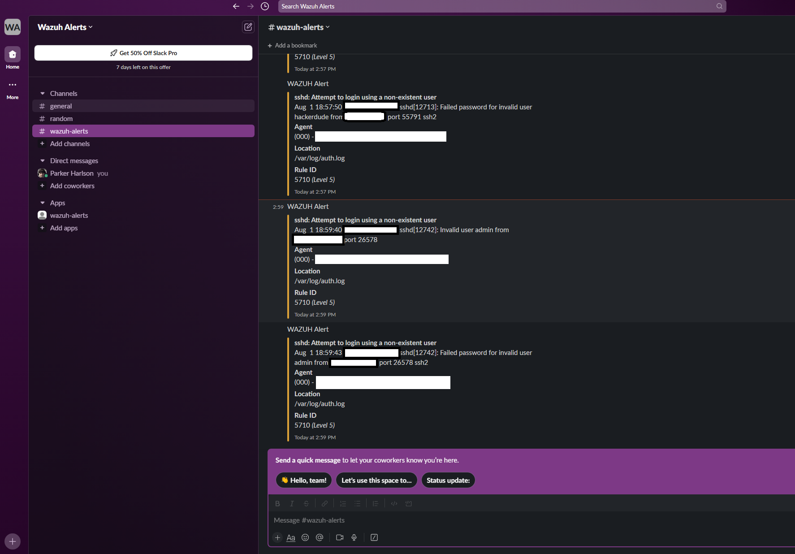